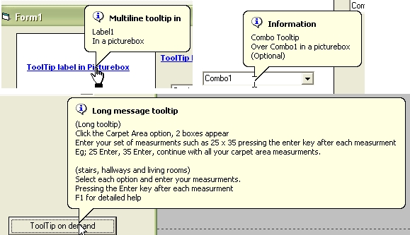



## LabelComboToolTips

### Description

Baloon tooltips for combobox and labels. Vb does not have a mousemove for a combobox. This code will display a baloon tooltip when over the text portion of a combobox. Also a tool tip on demand for long tooltips displays. Also includes the finger cursor.
 
### More Info
 

             |
---                |---
**Submitted On**   |2009-05-31 19:31:38
**By**             |[Rob Moore](https://github.com/Planet-Source-Code/PSCIndex/blob/master/ByAuthor/rob-moore.md)
**Level**          |Advanced
**User Rating**    |4.6 (23 globes from 5 users)
**Compatibility**  |VB 6\.0
**Category**       |[Custom Controls/ Forms/  Menus](https://github.com/Planet-Source-Code/PSCIndex/blob/master/ByCategory/custom-controls-forms-menus__1-4.md)
**World**          |[Visual Basic](https://github.com/Planet-Source-Code/PSCIndex/blob/master/ByWorld/visual-basic.md)
**Archive File**   |[LabelCombo2153785312009\.zip](https://github.com/Planet-Source-Code/rob-moore-labelcombotooltips__1-72134/archive/master.zip)

